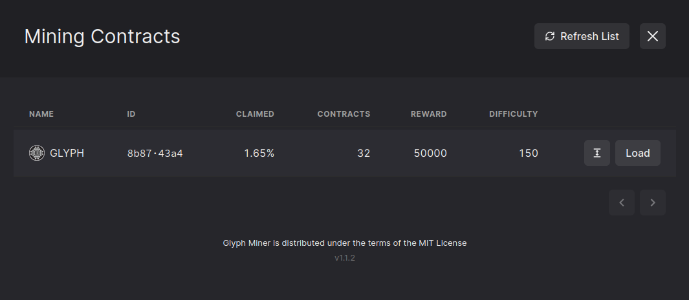

# Contracts integrated in GLYPH mining

**Disclaimer:** This Github is **NOT** responsible for the creation, origin, use of the embedded contracts. 

## Conditions for adding contracts

The Radiant network is free and unrestricted, but adding a token contract to this list has conditions:

No name or image allowed:
- NSFW.
- Racism.
- Violence.
- Duplicate names (the date of the contract decides who will be on the list).

These conditions will be updated as we review the embedded tokens.

## How to add a token 

Follow this guide:

- [Guide](Tokens/README.md)

If you have any questions, ask us in our **Discord**:

[https://discord.gg/radiantblockchain](https://discord.gg/radiantblockchain)

**GLYPH MINING URL**: [https://glyph.radiant4people.com](https://glyph.radiant4people.com)

