# HOW ADD TOKENS IN GLYPH MINING

## Required

- Have published the token in Radiant's Discord.
- Have a Github account.
- Make a fork of this repository.
- Add token data.
- Make a Pull request with the added data.

## Publish information on Discord.

Before making the request on Github, it is necessary that the token is first published on Radiant's Discord in the #tokens-listings channel.

**Discord**: [https://discord.gg/radiantblockchain](https://discord.gg/radiantblockchain)

Example:

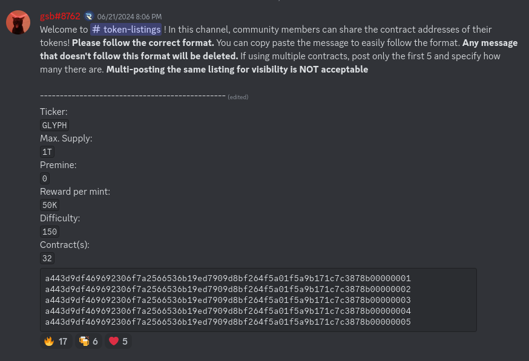

## Github

To add the token to the official GLYPH MINING LIST, you need to have a Github account and follow the steps below:

#### Create a fork of the repository

When you are logged in with your account, you must go to the following address:

[https://github.com/RadiantBlockchain-Community/glyph-contracts](https://github.com/RadiantBlockchain-Community/glyph-contracts)

----

#### Click on the Fork button:

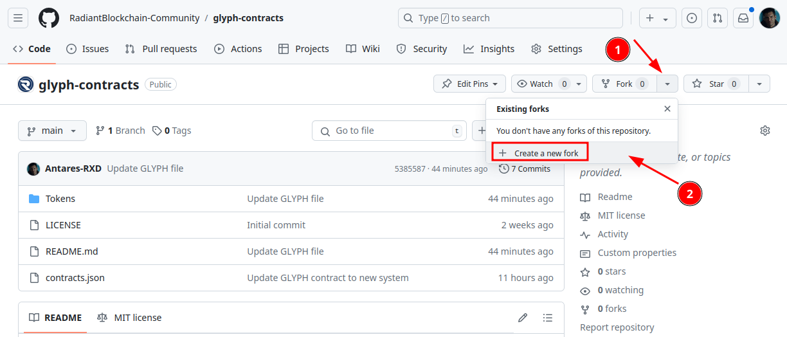

----

#### Finalize the fork in your own repository:

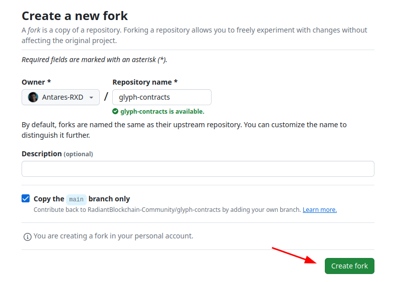

----

####  Go to the fork in your own repository and edit the file template.md

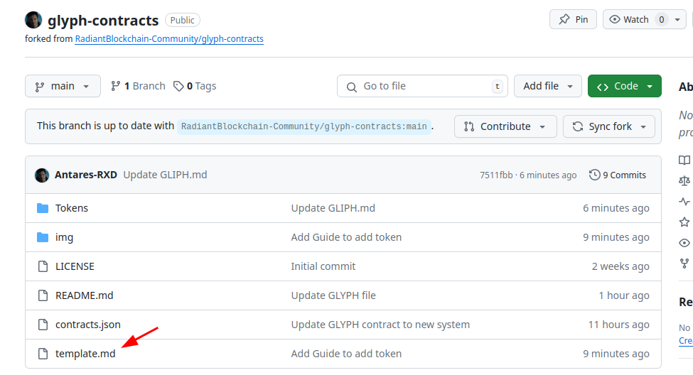

----

#### Copy RAW code

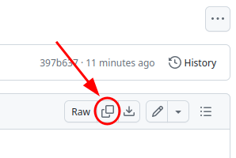

----

#### Go to Tokens directory:

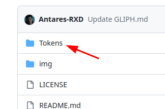

----

#### Create a file with the token's TIKER in uppercase ending in .md, such as GLYPH.md

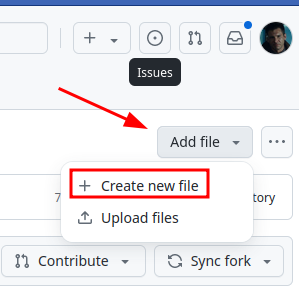

----

#### Create Token file  

1. Add TOKEN name with .md.
2. Past template RAW and edit with Token info

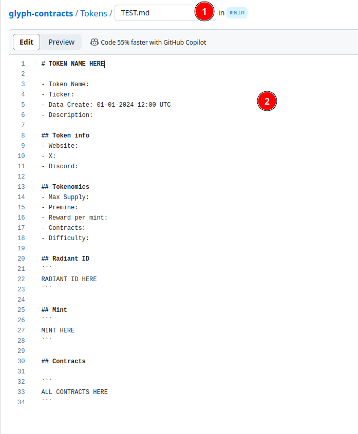

----

#### Once you have filled in the data, you now need to save it.

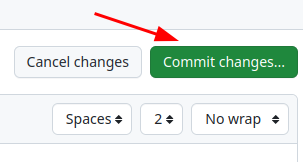

----

#### Click on the link to create the PR to official repository:

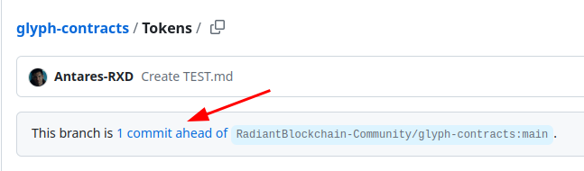

----

#### Create pull request

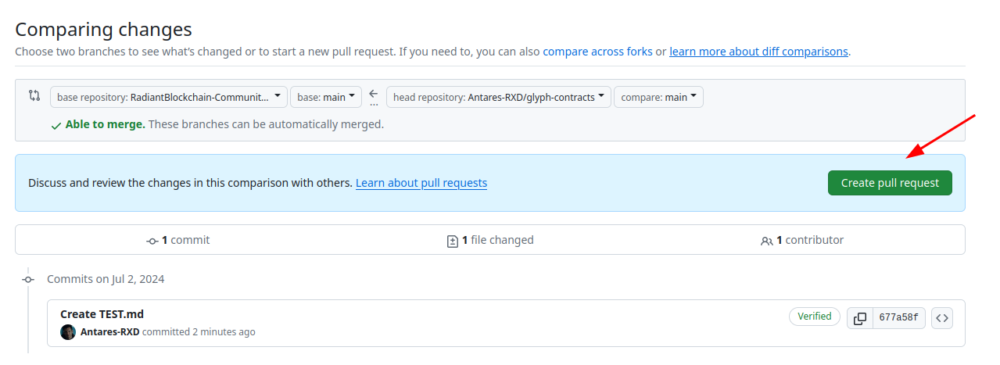

----

#### Add info in Pull Request  
1. [ADD TOKEN] - Token Name
2. Link to the publication in Discord.
3. Create pull request.

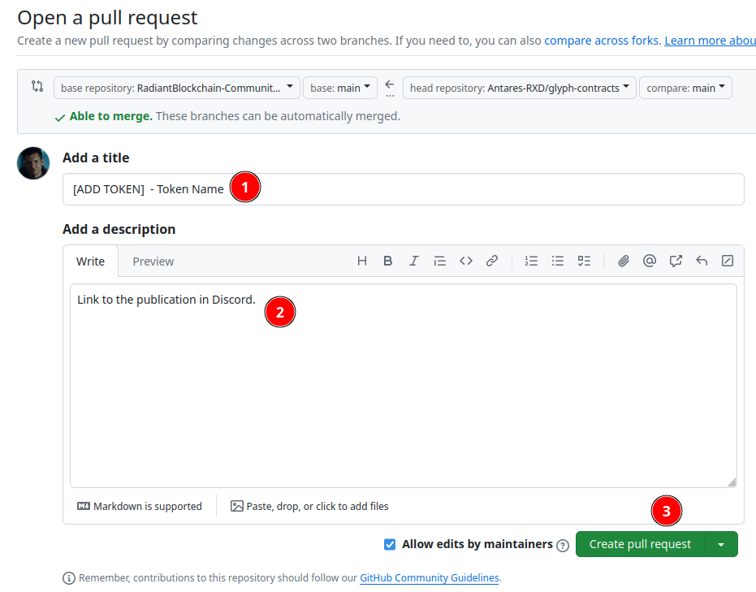

----

#### Once the PR is done, it will appear in the following link and will be open for review by someone from the community:

[https://github.com/RadiantBlockchain-Community/glyph-contracts/pulls](https://github.com/RadiantBlockchain-Community/glyph-contracts/pulls)

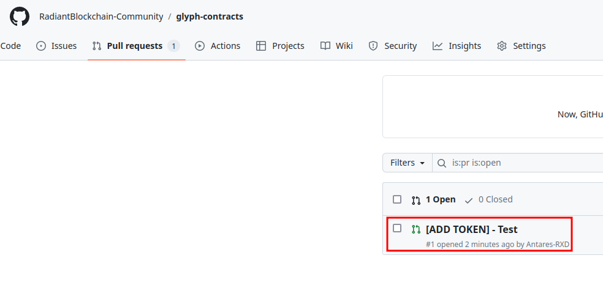

----

## PR Status

There will be two statuses:

- **Accepted**: the token data will be added to the community GITHUB and the contract will be added in the contracts.json file. From this moment on it will take about 24h to appear in GLIPH MINING.  
- **Rejected**: There is some incorrect data or it does not meet the rules to be added. If information is missing, it will be indicated that it needs to be changed and the creator will have to modify the template of his token.

----

**GLYPH MINING**: [https://glyph.radiant4people.com](https://glyph.radiant4people.com)